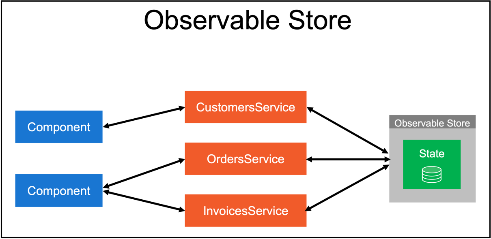

# State Management

There are a bunch of options for managing state in Angular apps including just using services but for apps as large and complex as DataRap two stuck out as real options to me

-   NgRx (popular, has extensions, implements Redux pattern with observables
    -   Can be pretty verbose but the pattern isn't too complicated
    -   Has CLI schematics which can speed development
    -   Has a really nice browser extension which can help with debugging (Redux extension)
    -   Has extension for angular router
    -   https://ngrx.io/
-   ObservableStore (more simple than NgRx, less robust, less tooling, still a good option)
    -   https://github.com/DanWahlin/Observable-Store
    -   Logs what actions take place and what the data is to the console
    -   Less code to write

## NgRx / Redux Pattern

## ObservableStore Pattern

